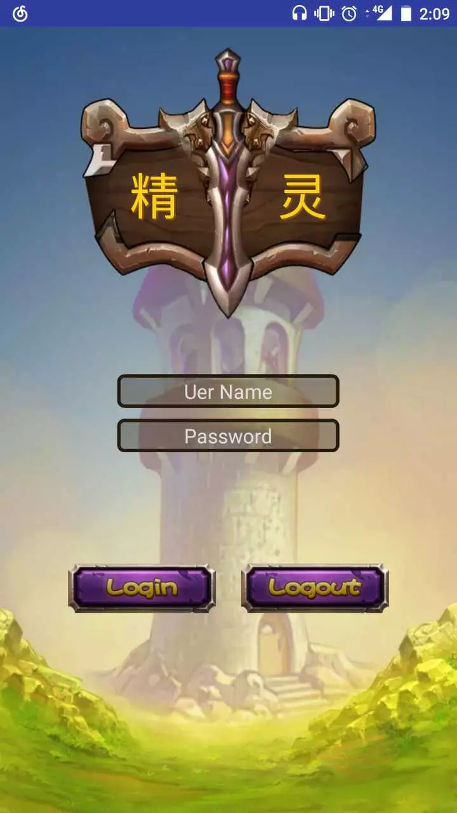
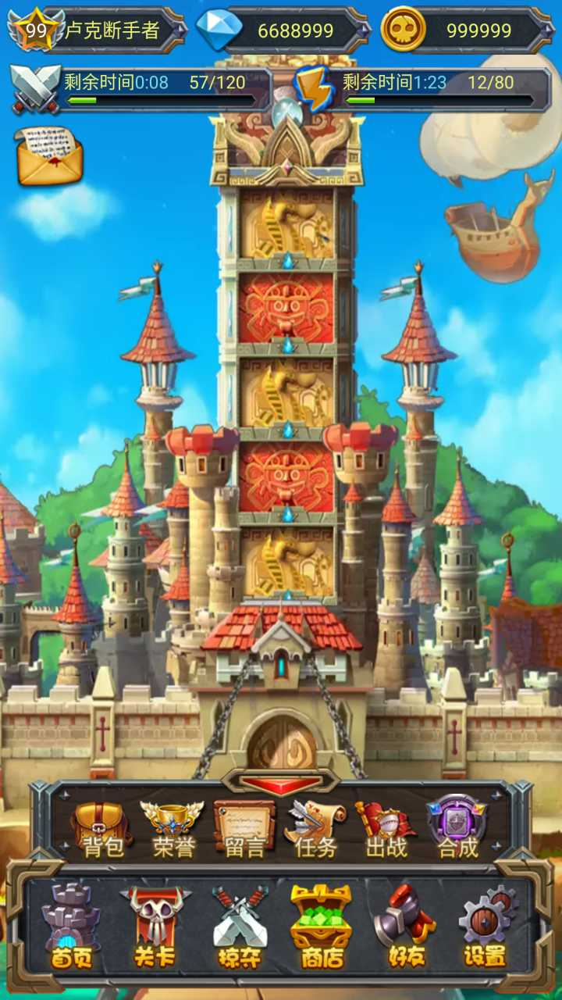
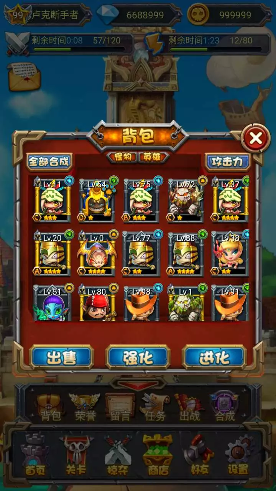

# AndroidSpiritGame(2017.5.25)
##### 这个是 Android UI 课程的大作业程序，是一个只有游戏界面和基本交互效果的大作业

## Author:OuFungWah

## 注意：
##### 本项目中，一些基本的Activity操作为了方便使用我们封装到了BaseFragmentActivity 中了，如: findViewById(id) 这样的操作我们进行了从新封装变成 findView(id)
##### 本项目中，一些动画操作的Java代码我们也封装起来了
##### 本项目仅用于学习交流作用，若发现有错，可联系本人

## Part1:Login
##### 登录部分，这是我们已进入 app 时能看见的第一个页面
##### 相关布局文件: 
* ##### app/src/main/res/layout/login_activity.xml
##### 相关Java文件: 
* ##### app/src/main/res/main/java/activity/LoginActivity.java
##### 完成图：

##### 实现提示：
* **使用LinearLayout可以以比例的形式很好地控制好控件地高度 关键字(LinearLayout，比例)**
* **输入框的背景实现可以通过自定义Drawable文件来的方式完成 关键字(shape)**
* **图片的点击效果我们可以通过 自定义Drawable文件的方式完成 关键字(selector)**

## Part2:HomePage
##### 游戏的主页面，通过 login 页面的 login 按钮进入
##### 相关布局文件: 
* ##### app/src/main/res/layout/activity_main.xml
* ##### app/src/main/res/layout/bottom_include.xml 
* ##### app/src/main/res/layout/title_include.xml 
* ##### app/src/main/res/layout/homepage_fragment.xml 
##### 相关Java文件:
* ##### app/src/main/res/main/java/activity/MainActivity.java
* ##### app/src/main/res/main/java/fragment/HomePageFragment.java
* ##### app/src/main/res/main/java/adapter/MyVPAdapter.java
* ##### app/src/main/res/main/java/util/Tools.java
##### 完成图

##### 实现提示:
* **进度条的样式我们可以通过自定义drawable文件来完成 关键字 (Layer-list)**
* **使用RelativeLayout作为父布局可以轻松解决控件分别靠在页面的上下两端 关键字(RelativeLayout)**
* **使用自定义anim文件可以轻松使用Android巨大的动画框架来帮助我们实现简单的动画，如放大缩小 关键字(anim,scale)**
* **因为我们的按键被要求按下时缩小，直至缩手再恢复，这里我们不能简单的使用onClickListener来监听点击事件， 而是应该使用OnTouchListener来监听整个触摸事件，按下时进行动画，缩手时结束动画并判定为一个点击事件 关键字(OnTouchListener,Animation)**
* **我们可以使用Google给出的View的动画效果来实现二级菜单的上下移动 关键字(ObjectAnimator)**
* **我们的主页和商店之间是同一个页面，这里我们需要使用到Fragment加ViewPager来实现这个两个部分之间滚动效果 关键字(Viewpager,Fragment)**

## Part3:Bag
##### 在游戏界面的底下的二级菜单栏点击进入，可以浏览所拥有的英雄
##### 相关布局文件: 
* ##### app/src/main/res/layout/bag_dialog.xml
* ##### app/src/main/res/layout/recycle_view_item.xml 
##### 相关Java文件:
* ##### app/src/main/res/main/java/activity/MainActivity.java
* ##### app/src/main/res/main/java/adapter/MyRecyclerAdapter.java
* ##### app/src/main/res/main/java/bean/Hero.java
* ##### app/src/main/res/main/java/bean/InitHeroList.java
* ##### app/src/main/res/main/java/bean/ResBean.java
##### 完成图

##### 实现提示:
* **这种浮动于界面上的视图，最好的实现方式就是使用自定义对话框了 关键字(Dialog)**
* **英雄列表这种列表型的控件，我们使用RecyclerView来实现 关键字(RecyclerView)**

## Part4:Shop
##### 在游戏界面的底下点击商店可转跳至商店部分。注意不是跳转页面，只是ViewPager的换页
##### 相关布局文件: 
* ##### app/src/main/res/layout/bag_dialog.xml
* ##### app/src/main/res/layout/recycle_view_item.xml 
##### 相关Java文件:
* ##### app/src/main/res/main/java/activity/MainActivity.java
* ##### app/src/main/res/main/java/adapter/MyRecyclerAdapter.java
* ##### app/src/main/res/main/java/bean/Hero.java
* ##### app/src/main/res/main/java/bean/InitHeroList.java
* ##### app/src/main/res/main/java/bean/ResBean.java
##### 完成图

##### 实现提示
* **在安排商店布局的时候注意要给页面的菜单栏和头顶的状态栏预留位置**
* **商店的那个牌子由于给的图片比较奇葩，所以需要我们自己用布局的排版来迁就图片的位置。
 这里推荐使用RelativeLayout作为底层布局再在上面进行排版 关键字(RelativeLayout，LinearLayout，比例)**

## Part5:ChargeMoney
##### 在游戏的商店页面点击充值时跳出的对话框
##### 相关布局文件: 
* ##### app/src/main/res/layout/self_dialog_include.xml
##### 相关Java文件:
* ##### app/src/main/res/main/java/fragment/ShopFragment.java
##### 完成图

##### 实现提示
* **同样时自定义对话框 关键字(Dialog)**